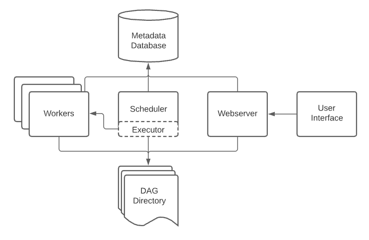

# Airflow

## 問題出現

在 Linux 中，工作排程一般使用 crontab，但這個設定通常很分散，並且如果其中一個掛掉，也很難分清楚先後順續。因此，如何讓「工作排程」更容易設定與管理，就是 Airflow 出現的原因。

## Airflow 是什麼

Apache Airflow 於 2014 年 10 月由 Airbnb 工作師推出的開源軟件，透過 Python 編寫的有向無環圖 (DAG) 來描寫工作流程之間的關係之後，進行自動執行，管理及回報。使用者亦可透過使用用戶操作介面（UI）來輕易進行管理操作和瀏覽。

> DAG：是「有向無循環圖」的縮寫。依照連接任務的箭頭產生順序與方向，且不能循環。DAG中的每個節點都對應著一個任務，而任務為資料處理的方式。是Apache中Airflow工具的核心。

## Airflow 的架構



* Web Server：提供用戶操作介面（UI）

* Scheduler：負責排程 DAG 任務。Scheduler 定期掃描 DAG 的資料夾，檢查 Metadata Database 中是否已經有 DAG Run 實例，如果沒有就創建一個，如果有就辨認是哪一個實例

* Metadata Database：儲存有關 DAG、任務的相關資訊。該資料庫可以是任何支援 SQL Alchemy 的資料庫，例如 PostgreSQL、MySQL 或 SQLite

* Executor：負責執行任務。Airflow 提供三種執行器：

  * LocalExecutor：在與 Airflow 排程器和網頁伺服器相同的機器上執行任務，適合於本地開發和測試。
  * CeleryExecutor：使用 Celery 分佈式任務佇列在遠端工作節點上執行任務，非常適合生產環境。
  * KubernetesExecutor：在 Kubernetes 叢集上執行任務，適用於雲端環境或內部 Kubernetes 叢集。

其他相關的 Airflow 概念：

* DAG

    在 Airflow 中，DAG 是一組以特定順序安排的任務集合，可以執行以實現特定目標。每個 DAG 中的任務都是一個獨立的工作單元，並且可以單獨執行。任務之間的相依性由 Python 程式碼定義。


* Variables

    Airflow 的變數是用於儲存任意配置設定或參數的鍵值對，可以在 DAG 或任務中引用。例如 API 金鑰、檔案路徑或電子郵件地址。變數可以透過 Airflow 的使用者介面或終端中的 airflow variables 指令來建立或修改。在 DAG 或任務中，可以透過 Variable.get() 方法存取這些變數。

* Connections
    
    Airflow 的連線用於定義 DAG 或任務可能使用的外部資源，例如資料庫或雲端存儲服務。連線以鍵值對的形式定義，其中鍵是連線名稱，值是描述連線參數的字典。

    使用者可以通過 Airflow 的使用者介面或終端中的 airflow connections 指令來建立或修改連線。在 DAG 或任務中，可以使用 Connection.get() 方法存取這些連線。

* Plugins

    插件是用於擴展 Airflow 功能的自包含套件。插件可以用於添加新的操作器（Operators）、鉤子（Hooks）、感測器（Sensors）、巨集（Macros）等自訂功能。

    插件可以使用 Python 開發，並且有許多現成的插件可供使用或修改，以滿足特定需求。

## 使用 Docker compose 安裝 Airflow local 環境

現在我們已經對 Airflow 架構有了基本的了解，接下來讓我們看看如何使用 Docker Compose 創建一個具有 LocalExecutor 的 Airflow 環境。

要使用 Docker Compose 創建一個最小的 Airflow 環境，我們只需要定義三個服務：Airflow Webserver、Airflow Scheduler 和 PostgreSQL。

> 在 Prod 環境中，通常需要更多的服務。

安裝：

> [官方文件](https://airflow.apache.org/docs/apache-airflow/stable/howto/docker-compose/index.html)

1. Fetch the docker-compose file

```bash
curl -LfO 'https://airflow.apache.org/docs/apache-airflow/2.10.4/docker-compose.yaml'
```

2. 初始化資料夾

```bash
# 建立 Airflow 資料夾
mkdir -p ./dags ./logs ./plugins ./config
echo -e "AIRFLOW_UID=$(id -u)" > .env
```
> .env 檔要放在和 docker-compose.yaml 同一個目錄，才能將 UID 設定好。

3. 啟動 Airflow 初始化

```bash
docker compose up airflow-init
```

3. 啟動 Airflow

```bash
docker compose up
```

https://stackoverflow.com/questions/55274601/airflow-valueerror-unable-to-configure-handler-processor-wasb-logger